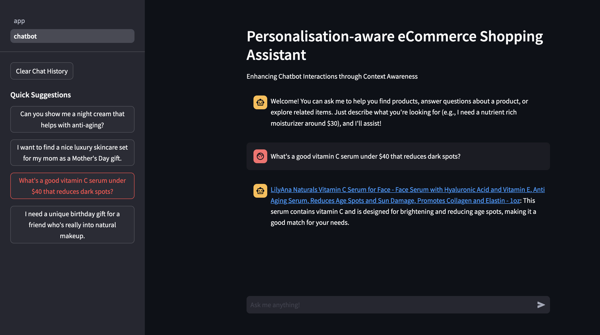

# Personalization Aware eCommerce Shopping Assistant

⭐️ Honorable Mention in [HackAI - Dell and NVIDIA Challenge](https://hackaichallenge.devpost.com/) with over 4500 participants and 111 projects! Check the [Devpost page](https://devpost.com/software/personalization-aware-e-commerce-shopping-assistant) for a demo video.

This project is a streamlit chatbot that implements a generative recommender system. The chatbot is designed to help users find Amazon beauty and personal care products. It is implemented using LangChain, LangGraph, Qdrant, and Neo4j.

## Description

Refer to the [blog post](./blog_post.md) for a detailed description of the project, including an explanation of the features and functionality of the application.

## Getting Started

This project is supposed to be run using [NVIDIA AI Workbench](https://docs.nvidia.com/ai-workbench/user-guide/latest/overview/introduction.html). It is designed to be run on any target system.

You can clone the GitHub URL of this project in the AI Workbench and build the project there. You also need to add API keys in the secrets section. Please use the API keys in the section at the bottom of this document. Build the environment in AI Workbench and once it is done, simply launch the chatbot from the applications section. It will automatically open up in your default browser. 

Without NVIDIA AI Workbench, you can run the project locally by following the steps below.

1. Install `python>=3.11` and `requirements.txt`. Optionally, install Ollama and `mistral-nemo` to run the `kg_generation.ipynb` notebook.
2. Setup environment variables in a `.env` file.
3. Run the streamlit app using `cd code/chatbot && streamlit run app.py`.
