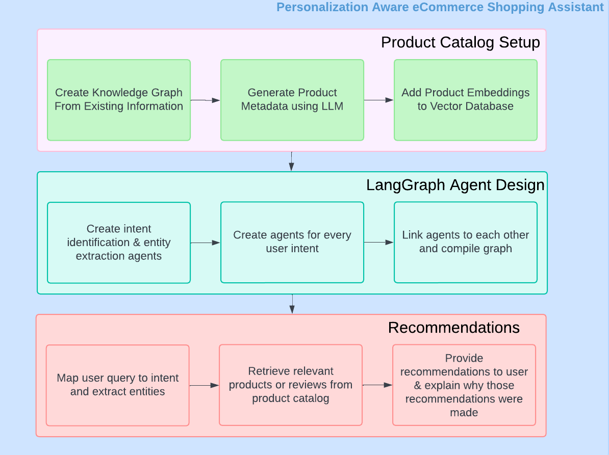
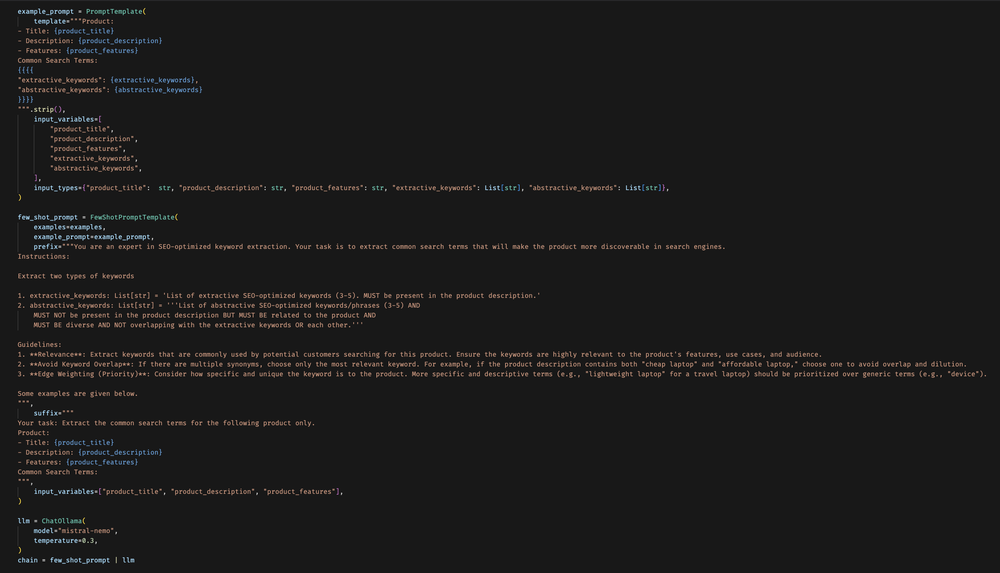
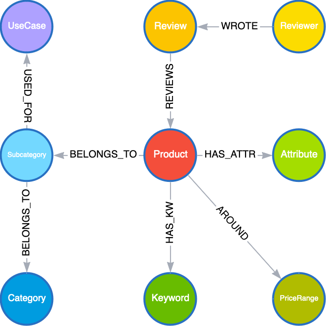
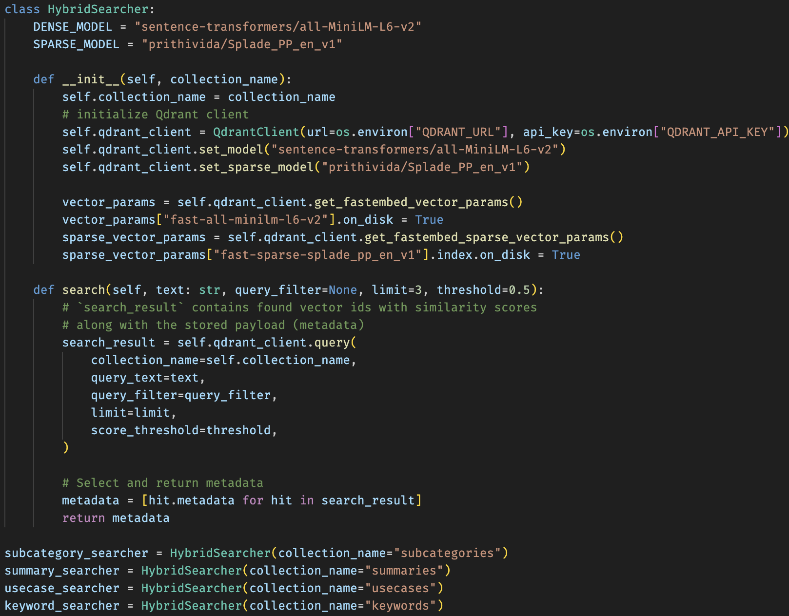
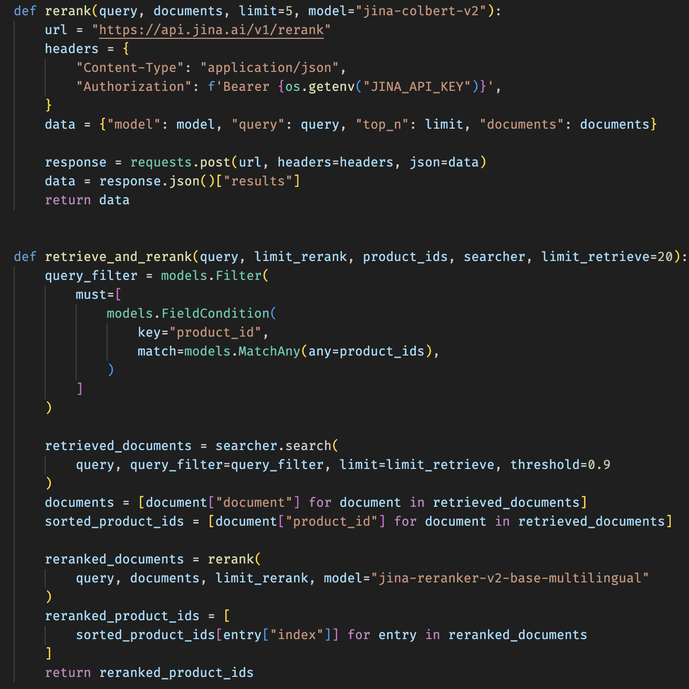
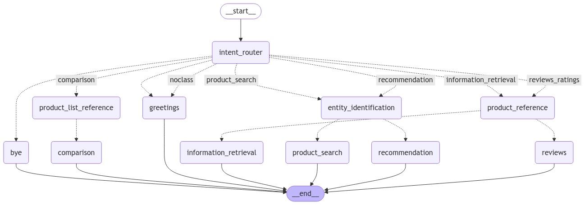

# Personalization Aware eCommerce Shopping Assistant

*Supercharging conversational recommendations with LLMs using Knowledge Graphs and Vector Databases*

This project creates a generative recommender system for Amazon **beauty and personal care products**, focusing on **content** and **user experience**. Content refers to detailed product metadata that enhances discovery, while user experience emphasizes the move from keyword-based search to personalized recommendations and conversational interfaces.

The below figure shows the steps that were taken to design this system.

## Inspiration

Traditional e-commerce platforms rely heavily on specific keywords, limiting user interaction and leading to mental fatigue. This **keyword-based** search results in only 10% of the catalog being shown, making most products invisible. Additionally, unclear recommendations leave users confused about why certain items are suggested, creating a frustrating experience and reducing trust.

Improving **product visibility** starts with identifying the right category or subcategory in user queries. For example, a search for “alcohol-free drink” should show non-alcoholic beer by linking the query to the right subcategory, even if the product description lacks those words. This makes searches more intuitive.

Another important step is **explaining why** products are recommended. For instance, linking insomnia to essential oils or Epsom salt baths makes suggestions more relevant. Embedding knowledge in the catalog allows businesses to offer clear reasons why a product is helpful, making recommendations feel personalized and increasing user confidence.

## Product Catalog Setup

### Knowledge Graph

The project implements these solutions using a subset of 958 Amazon products and reviews from [McAuley Lab](https://amazon-reviews-2023.github.io). This data is integrated into a knowledge graph in Neo4j. Additional metadata is extracted using the pretrained LLM `mistral-nemo` via [Ollama](https://ollama.com/library/mistral-nemo). The extracted metadata includes:

- Search engine optimized keywords to capture words commonly associated with a product. 
- Key attributes for a product that ensure a more precise match with customer queries and preferences.
- Product summaries to be used for product comparison and research queries.
- Common usecases for subcategories of products to connect vague user intents to specific product interactions.

Careful prompt engineering was done to extract meaningful and accurate metadata for each product. For example, the below code snippet shows the chain to generate keywords:

Finally, the following knowlege graph schema was designed and populated in Neo4j.

A `PriceRange` node is also shown in the graph. This is used to answer queries like "I am looking for a product *around* $30". Usually, customers ask for products that cost less than some price, but they may also ask for products around that price. To answer this, these nodes capture lower and upper bounds for the price of a product. The intervals increase as the price of a product increases.

### Retrieval and Reranker

A hybrid search feature is implemented for the following scenarios:

- After parsing the subcategory from the user's query, find synonyms in the vector DB from the subcategory collection
- Find products similar to a particular product based on the product summary or find products with the same intent as the user's query
- Find products that contain keywords or attributes synonymous to those mentioned in a user query
- Find usecases for product subcategories that match the intent of the user's query 

Current systems typically use only product names for summary embeddings, missing much of the product’s characteristics. A better approach is to compile all available product data—title, rating, description, features, and more—into a single string that follows a template. This is summarized by an LLM and stored in the Qdrant vector database.

The process for retrieval is as follows:

1. Search for a larger subset of products using a retriever
2. Filter to the top `n` results using a reranker

## LangGraph Agent Design

The following graph captures the process diagram for the system of LLM agents that were implemented:

### Product Search and Recommendation

- An intent node parses user intent and entities such as subcategory, price range, attributes, and keywords
- If `product_search`, a Cypher query is made against Neo4j to find products that match the filters provided. Retrieval and reranking is done to reduce the size of the returned products. Finally, the remaining products' title and summary are passed to the LLM for retrieval augmented generation (RAG)
- If `recommendation`, use-case, subcategory, and keyword nodes are found via hybrid search and reranking. Products related to those nodes are then retrieved. In case no matching products are found, a hybrid search is made against summary nodes. As before, the last step is RAG.

### Information Retrieval, Product Reviews, and Comparisons

#### Information Retrieval

When a user inquires about a specific product or type of product, the system provides detailed product information, such as specifications, features, or usage details. If the user has already searched for this product, the system directly retrieves the relevant nodes from the knowledge graph. If it's a new inquiry, the system pulls the product’s details and any related data from the catalog.

For example:
- A user asks, "What are the key ingredients of the third product?"
- The system fetches information about the product id of the 3rd product, including its description, features, and pricing, from the knowledge graph and presents them in an easily digestible format.

#### Product Reviews and Ratings

When users ask for reviews or feedback, the system pulls relevant review data from the knowledge graph and summarizes customer opinions.

#### Product Comparison & Alternatives

If more than one product is mentioned, the system shifts to comparison mode, allowing users to view side-by-side comparisons of features, prices, and ratings.

For example:
- “Which is better for dry skin, the first serum or the last one?” triggers the system to compare the two serums' keywords, attributes, ratings, and price - displaying the differences clearly in a table.

In comparison mode, the system highlights key metrics, helping users make informed de cisions based on their priorities, whether it’s price, features, or customer feedback.

## Deployment of Recommender System

The system is packaged and containerized using NVIDIA AI Workbench. Required environments, models, and secrets are added during the build process, and the project is published to a Git server. A chatbot application is built using Streamlit, allowing users to clone the GitHub project, set up the environment, and launch the chatbot on `localhost:8502`.

## References

- Chen, C.-W. (2024, March 8). Real-world applications of LLMs for eCommerce. Presented at ISIR-eCom @ WSDM 2024, Mérida, Mexico.
- Hou, Y., Li, J., He, Z., Yan, A., Chen, X., & McAuley, J. (2024). Bridging language and items for retrieval and recommendation. arXiv preprint arXiv:2403.03952.
- Wang, H. (2024, January 29). Embracing Generative AI: The Dawn of a New E-commerce Experience. https://haixun.medium.com/generative-ai-for-ecommerce-9fc1a9a7237e